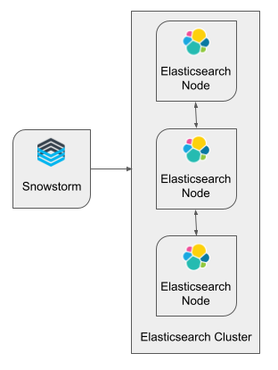
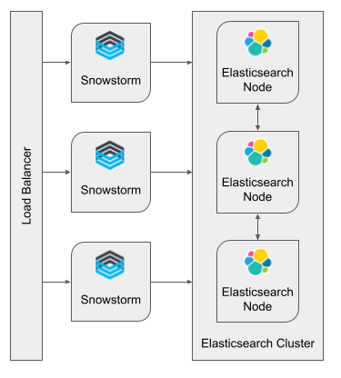
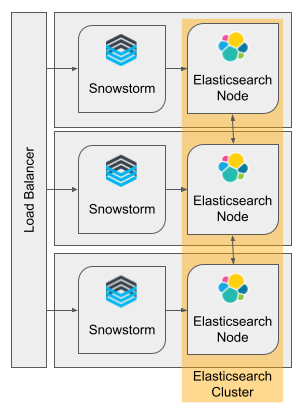

# Load Balancing
In a production environment it may be desirable to have fault tolerance by balancing API requests across more than one service instance.

This page provides some background information and some suggested deployment configurations to try.

## Two components to load balance
A Snowstorm deployment is made up of two components; the Snowstorm application and the Elasticsearch cluster. Elasticsearch holds all persistent data. 
Snowstorm holds a few items in memory; for example caches and details of asynchronous write operations.

These two components can be scaled independently with the following constraints:
- **There can only be one Snowstorm instance for authoring SNOMED CT content**.
  - This is because some asynchronous functionality (e.g. classification, branch merge review) use in-memory processes that would not be accessible to multiple instances.
   
 
- **Elasticsearch index "shards" and "replicas" must be adjusted to fit the number of Elasticsearch nodes**.
  - The default configuration has one shard and zero replicas, each index will only ever use one node.

## Option A - One Snowstorm Instance, Many Elasticsearch Nodes
In this deployment configuration there is one Snowstorm application instance connected to an Elasticsearch cluster made up of many Elasticsearch nodes.
This can give fault tolerance in Elasticsearch if the indices are configured with a replica.

This setup can be used for the authoring use case as well as read only.

An HTTP load balancer is not actually required in this configuration.

SNOMED International currently use this setup for: 
- **SNOMED CT Public Browser (read only)**
  - Index configuration: 3 shards, 0 replicas.
  - This configuration was found to give high read throughput in performance tests.
  - There is no fault tolerance because no replicas. If one Elasticsearch node fails the cluster will not function properly.
  - The lack of fault tolerance is mitigated by automatic regular incremental snapshot backups, automatic monitoring and a one-click data restore function.

 
- **SNOMED CT Authoring Platform (read/write)**
  - Index configuration: 1 shard, 1 replica.
  - This configuration gives a balance of throughput and fault tolerance.
  - The replica means that if one Elasticsearch node fails the cluster will continue to work with no data loss.
  - Monitoring is in place to automatically remove a failed node and add a new one to the cluster in the event of a hardware failure.

## Option B - Many Snowstorm Instances, Many Elasticsearch Nodes
In this deployment configuration there are many Snowstorm application instances and connected to an Elasticsearch cluster made up of many Elasticsearch nodes.
An HTTP load balancer spreads traffic between the Snowstorm instances.
This gives fault tolerance of the Snowstorm application and Elasticsearch service (if an index replica is used).

This setup can be used for read only use cases. The authoring use case could be accommodated by this configuration if all authoring traffic is routed to a dedicated Snowstorm 
instance for authoring. 

_Please bear in mind that when any Snowstorm instance starts it will fail all running classification jobs because the application assumes that the 
authoring instance has been killed and restarted._

## Option C - Many Snowstorm-Elasticsearch Pairs
In this deployment configuration there are many servers, each containing a Snowstorm and Elasticsearch node pair. 
Each Snowstorm application connects directly to its local Elasticsearch node. Each Elasticsearch node is within the same 
overall Elasticsearch cluster. 

An HTTP load balancer spreads traffic. This gives fault tolerance of the Snowstorm application and Elasticsearch service (if an index replica 
is used).

As with option B the read-only use case is supported and authoring could be accommodated.

This configuration has not been tested but it is expected to give the best read performance.

### Autoscaling
In theory Option C could achieve autoscaling by starting and stoping Snowstorm-Elasticsearch pair instances as needed. An index configuration with 1 shard, 5 replicas should
allow new instances (up to 5 in total) to have data replicated to them when they join the cluster. The new instance should only join the load balancer once the Elasticsearch 
node is provisioned.
One node should stay up all the time to keep Elasticsearch hot.
